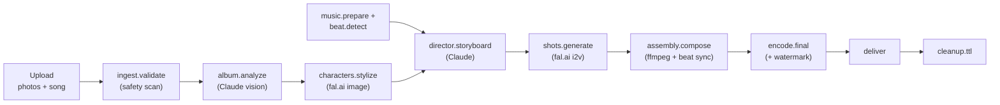

# OPmylife

**Turn a photo album and a song into a beat-synced, ~90-second animated opening where you're the main character.** Upload your photos, pick a style, and the pipeline stylizes the people in them, storyboards a sequence, generates the shots, and cuts them to the beat of the music.

🔗 **Live:** [opmylife.com](https://opmylife.com)

> **Public portfolio copy.** This is a sanitized snapshot of a personal product,
> published to show the architecture and engineering. It carries no secrets and
> no live infrastructure identifiers; some operational docs (billing/margin
> model, trust-&-safety runbook, cost tracking) live in a private repo.

---

## What it does

- **Three art styles** — hand-drawn **Anime** (sakuga-style motion), **Pixar-style 3D**, and painterly **Fantasy**. Each redraws the whole frame, people and background, in a consistent look.
- **Two generation modes:**
  - *Stylize your album* — turn your own photos into an animated music video.
  - *Animate Me* — lift the people out of your photos and **compose them into brand-new scenes** you describe in a prompt.
- **Beat-synced editing** — cuts land on the actual beats of the track (custom on-device beat detection, no music API).
- **Add your own song** — upload a track and the whole edit cuts to its beats.
- **Choose your video model** — Kling 2.1 (fast), Kling v3 Pro (default, high quality), or Google Veo 3.1 (premium), routed per shot.
- **Free watermarked previews** on a cheap model; **full-quality finals** are billed on a token/credit model (Stripe).
- **Bilingual UI** — English and Spanish, toggleable site-wide.
- **HEIC uploads** supported (iPhone photos convert client-side).
- **Privacy-first** — a distinct biometric-consent gate with a manual-tagging fallback, encryption at rest, and **server-side TTL auto-deletion** of inputs and outputs after each render.

## How it works

A durable, resumable job pipeline. The web app validates and enqueues; a separate worker does all the heavy lifting so requests return fast and renders outlive the browser session.



Per-stage contracts, the consent branch, the beat-sync grid, and the charge point are documented in [`docs/pipeline.md`](./docs/pipeline.md).

## Engineering highlights

- **Thin API / async worker split.** No heavy work runs in an API route — requests push a job descriptor to a **BullMQ (Redis)** queue; the worker runs the pipeline. This is the core architectural decision (see [`docs/architecture.md`](./docs/architecture.md)).
- **Custom beat detection, no external audio API.** ffmpeg decodes to mono PCM → per-frame energy flux → onset envelope → autocorrelation for tempo → phase search to align the beat grid the whole edit cuts to.
- **Cost-aware generation.** Previews run on a cheap, low-res, watermarked model; **credits are billed only on the final encode**, never on drafts or internal retries. Per-shot retries are capped and clips are reused in editing to halve the generation bill.
- **Deterministic title cards.** Text is rendered with SVG/ffmpeg, never asked of a video model — so typography stays crisp.
- **Trust & safety by design.** A content-scan gate runs in `ingest.validate` *before* any image reaches a model API; flagged content is blocked and placed on legal hold, exempt from deletion.

## Stack

| Layer | Choice |
|---|---|
| Frontend | **React 18 + TypeScript** on **Next.js 14** (App Router). Hand-written CSS, light/dark theming — no UI framework. |
| API | Next.js **route handlers** — thin, synchronous, enqueue-and-return. |
| Worker | Same codebase, separate process (`npm run worker`) — **BullMQ** consumer running the pipeline + ffmpeg assembly. |
| Data | **Postgres** (raw SQL via `pg`, no ORM), request validation with **zod**. |
| Queue | **Redis** (BullMQ / ioredis). |
| Storage | **Cloudflare R2** — presigned browser uploads + lifecycle TTL deletion. |
| AI — vision | **Anthropic Claude (Opus)** — photo analysis + director/storyboard. |
| AI — media | **fal.ai** gateway — image stylization (Nano Banana Pro, FLUX Kontext) + image-to-video (Kling, Veo). |
| Audio/video | **ffmpeg** (CPU) — beat detection, assembly, encode. |
| Auth | **Clerk** (Google / Discord / Facebook social login). |
| Billing | **Stripe** (token/credit purchases). |
| Hosting | **Railway** (one project, private networking: web + worker + Postgres + Redis); R2 on Cloudflare. |

## Repo layout

```
/app         Next.js routes — UI pages + thin API route handlers
/lib         shared modules (web + worker): env, db, queue, storage, models, billing, consent, auth, beat, i18n
/pipeline    one module per stage + the dispatcher
/worker      worker entry (npm run worker) — BullMQ processors + TTL sweeper
/db          schema.sql + migrate.ts
/docs        architecture & design docs
```

## Run it locally

Prereqs: **Node 20+**, **Docker** (local Postgres + Redis), and **ffmpeg** on PATH.

```bash
# 1. install
npm install

# 2. env — defaults work for local Docker + stub models
cp .env.example .env.local

# 3. datastores
docker compose up -d          # Postgres :5432 + Redis :6379

# 4. schema
npm run migrate

# 5. run both processes (two terminals)
npm run dev                   # web (UI + API) at http://localhost:3000
npm run worker                # pipeline + ffmpeg assembly
```

**Runs offline with zero external accounts.** `MODELS_MODE=stub` synthesizes deterministic media, and when R2/Clerk aren't configured the app falls back to a local filesystem storage driver and a stable dev user — so the full pipeline runs end-to-end on a laptop. Wire the real services when you're ready ([`docs/setup.md`](./docs/setup.md)).

## Docs

| Doc | Covers |
|---|---|
| [`docs/product-spec.md`](./docs/product-spec.md) | The product, the user journey, scope, non-goals |
| [`docs/architecture.md`](./docs/architecture.md) | System shape, the thin-API / async-worker boundary |
| [`docs/data-model.md`](./docs/data-model.md) | Postgres schema — tables, enums, relationships |
| [`docs/pipeline.md`](./docs/pipeline.md) | Per-stage pipeline contracts, consent branch, beat-sync, charge point |
| [`docs/privacy-and-consent.md`](./docs/privacy-and-consent.md) | Consent gate, biometric handling, TTL, exact privacy wording |
| [`docs/railway-deployment-topology.md`](./docs/railway-deployment-topology.md) | Services, env vars, private networking |
| [`docs/setup.md`](./docs/setup.md) | Going-live guide: hosting accounts + third-party integrations |

## License

Source-available for portfolio and evaluation only — **not** open-source. You may
read the code; you may not reuse, redistribute, or deploy it. See [`LICENSE`](./LICENSE).
